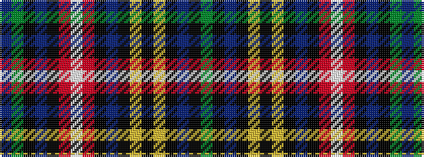

BGKBKRWRKBKYKYKBKG

It is a 18 stripe tartan.

<figure class="pat-woven">

<figcaption>idealised sample</figcaption>
</figure>

## Colour Sequence



## Tartans with this colour sequence

| Tartans |
|---------------|
| [Buchanan (Wilson)](/variants/s18/dg6k1db4k1ly6k1ly6k1db4k1r8w1r8k1db4k1dg6db4~x4/)|
||
| [Buchanan 2](/variants/s18/g12k1db4k1ly6k1ly6k1db4k1r8w1r8k1db4k1g6db4~x4/)|
||
| [Buchanan Clan Tartan](/variants/s18/g6k1db4k1ly6k1ly6k1db4k1r8w1r8k1db4k1g6db4~x2/)|
||
| [Buchanan Old Clan Tartan](/variants/s18/g6k1t3k1ly6k1ly6k1t3k1r6w1r6k1t3k1g6t3~x4/)|
||
