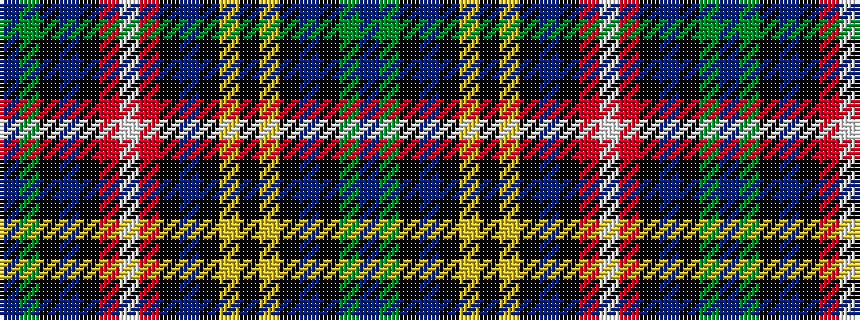

BGKBKRWRKBKYKYKBKGB

It is a 19 stripe tartan.

<figure class="pat-woven">

<figcaption>idealised sample</figcaption>
</figure>

## Colour Sequence



## Tartans with this colour sequence

| Tartans |
|---------------|
| [Buchanan (1850 - Clan)](/variants/s19/db9g23k3db9k3r20w3r20k3db9k3ly20k3ly20k3db9k3g23db9~x2/)|
||
