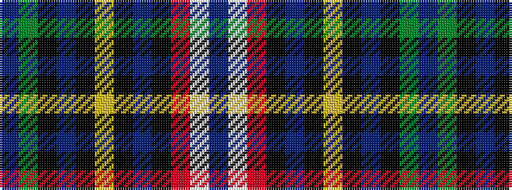

BGKBKYKBKRWB

It is a 12 stripe tartan.

<figure class="pat-woven">

<figcaption>idealised sample</figcaption>
</figure>

## Colour Sequence



## Tartans with this colour sequence

| Tartans |
|---------------|
| [MacWhirter](/variants/s12/t1dg8k1t2k1ly2k1t2k1r8w1t1~x4/)|
||
| [MacWhirter](/variants/s12/t1g8k1t2k1ly2k1t2k1r8w1t1~x4/)|
||
