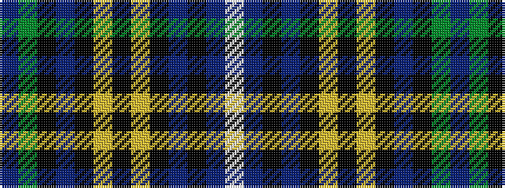

BGKBKYKYKBKBW

It is a 13 stripe tartan.

<figure class="pat-woven">

<figcaption>idealised sample</figcaption>
</figure>

## Colour Sequence



## Tartans with this colour sequence

| Tartans |
|---------------|
| [Reston (Personal)](/variants/s13/t4g32k2t4k2ly5k3ly5k2t4k2db32w4~x2/)|
||
