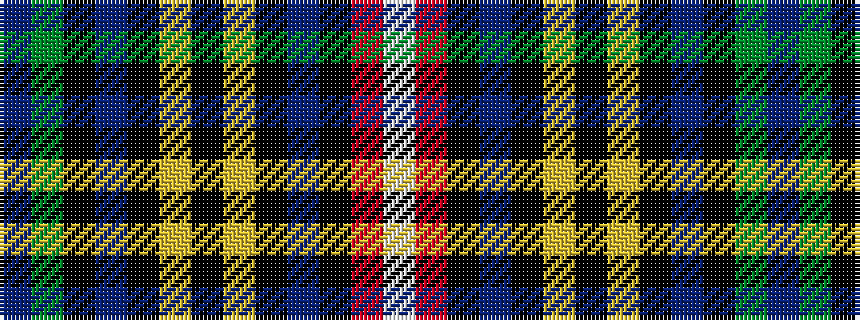

BGKBKYKYKBKRW

It is a 13 stripe tartan.

<figure class="pat-woven">

<figcaption>idealised sample</figcaption>
</figure>

## Colour Sequence



## Tartans with this colour sequence

| Tartans |
|---------------|
| [Baxter](/variants/s13/b2g16k1b2k1lo4k1lo4k1b2k1r16w2~x4/)|
||
| [Buchanan](/variants/s13/w2r16k1t2k1ly4k1ly4k1t2k1g16t1~x4/)|
||
| [Buchanan #2](/variants/s13/t3dg31k2t4k2ly8k2ly8k2t4k2r31w3~x2/)|
||
| [Buchanan #3](/variants/s13/t2dg12k1t2k1ly3k1ly3k1t2k1r12w2~x2/)|
||
| [Buchanan #4](/variants/s13/t4dg25k2t4k2ly8k3ly8k2t4k2r25w4~x2/)|
||
| [Buchanan (Logan)](/variants/s13/t2dg16k1t2k1ly4k1ly4k1t2k1r16w2~x4/)|
||
| [Buchanan 1](/variants/s13/t2g12k1t2k1ly3k1ly3k1t2k1r12w2~x2/)|
||
| [Buchanan 8](/variants/s13/t3g31k2t4k2ly8k2ly8k2t4k2r31w3~x2/)|
||
| [Buchanan 9](/variants/s13/t4g25k2t4k2ly8k3ly8k2t4k2r25w4~x2/)|
||
