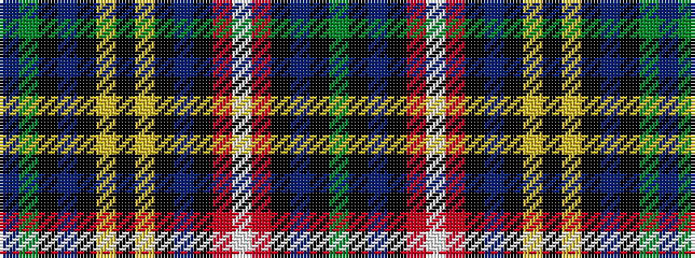

BGKBKYKYKBKRWRKBKG

It is a 18 stripe tartan.

<figure class="pat-woven">

<figcaption>idealised sample</figcaption>
</figure>

## Colour Sequence



## Tartans with this colour sequence

| Tartans |
|---------------|
| [Buchanan](/setts/s18/g23k3db9k3r20w3r20k3db9k3ly20k3ly20k3db9k3g23db9~x2/)|
||
