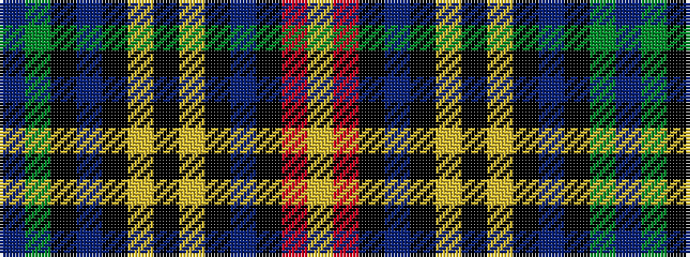

BGKBKYKYKBKRY

It is a 13 stripe tartan.

<figure class="pat-woven">

<figcaption>idealised sample</figcaption>
</figure>

## Colour Sequence



## Tartans with this colour sequence

| Tartans |
|---------------|
| [Buchanan D](/variants/s13/b2dg16k1b2k1ly4k1ly4k1b2k1r16lr2~x2/)|
||
