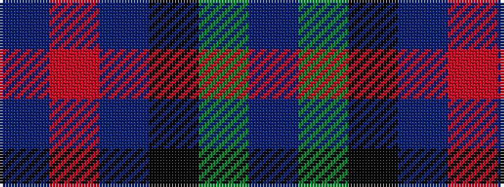

BGKBRB

It is a 6 stripe tartan.

<figure class="pat-woven">

<figcaption>idealised sample</figcaption>
</figure>

## Colour Sequence



## Tartans with this colour sequence

| Tartans |
|---------------|
| [Wellington or Waterloo](/variants/s6/t3dg12k14t11r3t3~x2/)|
||
| [Wellington, or Waterloo](/variants/s6/t3g12k14t11r3t3~x2/)|
||
| [Wellington, or Waterloo](/variants/s6/t3g6k6t4r1t1~x2/)|
||
| [Wellington, or Waterloo](/variants/s6/t3g8k9db7r2db2~x2/)|
||
