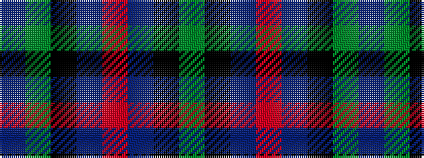

BGKBRBKG

It is a 8 stripe tartan.

<figure class="pat-woven">

<figcaption>idealised sample</figcaption>
</figure>

## Colour Sequence



## Tartans with this colour sequence

| Tartans |
|---------------|
| [Forbo Nairn Corporate Tartan Tartan Number: 2298. Earliest known date: pre 2002 Designed for Forbo Nairn Ltd - a Swiss based company with two factories in Kirkcaldy, Fife. Tartan is based on the Nairn (#1331) because of an association with Michael Nairn, builder of the first 'floor cloth' (linoleum) factory in Scotland in 1843.STS said Approved by Sir Robert Spencer Nairn. Blue and red used in this graphic in place of dark blue and red so that sett could be seen. See products available Copyright © Blair Urquhart, Comrie, 2015](/setts/s8/g8k7db12r2db12k7g8t2~x4/)|
|![Forbo Nairn Corporate Tartan Tartan Number: 2298. Earliest known date: pre 2002 Designed for Forbo Nairn Ltd - a Swiss based company with two factories in Kirkcaldy, Fife. Tartan is based on the Nairn (#1331) because of an association with Michael Nairn, builder of the first 'floor cloth' (linoleum) factory in Scotland in 1843.STS said Approved by Sir Robert Spencer Nairn. Blue and red used in this graphic in place of dark blue and red so that sett could be seen. See products available Copyright © Blair Urquhart, Comrie, 2015 example sett](/setts/s8/g8k7db12r2db12k7g8t2~x4/sett.png)|
