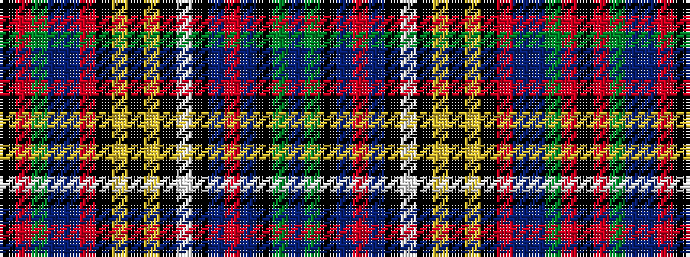

BGKBRBKWKYKYKRBBGRK

It is a 19 stripe tartan.

<figure class="pat-woven">

<figcaption>idealised sample</figcaption>
</figure>

## Colour Sequence



## Tartans with this colour sequence

| Tartans |
|---------------|
| [Anderson of Ardbrake](/variants/s19/k13r2g9db5t3r2k4ly2k2ly2k3w4k3db2r22t1k3g4t2~x2/)|
||
