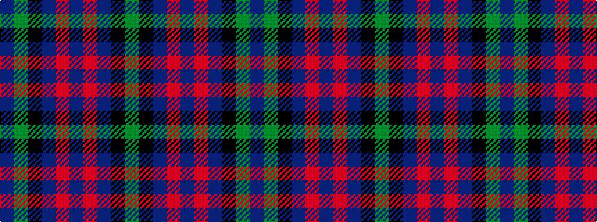

BGKBRBRBKG

It is a 10 stripe tartan.

<figure class="pat-woven">

<figcaption>idealised sample</figcaption>
</figure>

## Colour Sequence



## Tartans with this colour sequence

| Tartans |
|---------------|
| [Wellington (Wilson)](/variants/s10/dg8k9db7r2db2r2db7k9dg8t3~x2/)|
||
| [Wellington (Wilson) #2](/variants/s10/g12k14t11r3t3r3t11k14g12t3~x2/)|
||
