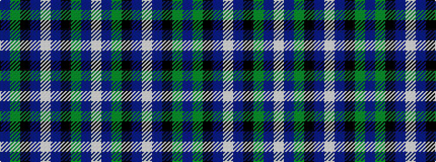

BGKBWBKGBW

It is a 10 stripe tartan.

<figure class="pat-woven">

<figcaption>idealised sample</figcaption>
</figure>

## Colour Sequence



## Tartans with this colour sequence

| Tartans |
|---------------|
| [Norwich No.026](/variants/s10/w2db10k10g11db2w2~x2/)|
||
