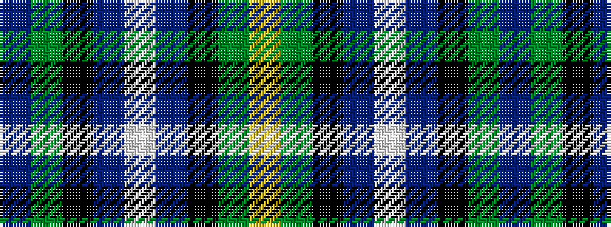

BGKBWBKGY

It is a 9 stripe tartan.

<figure class="pat-woven">

<figcaption>idealised sample</figcaption>
</figure>

## Colour Sequence



## Tartans with this colour sequence

| Tartans |
|---------------|
| [St Brigid's Parish Triple Celebratio](/setts/s9/db2dy12k1b5w3b5k1g30ly2~x2/)|
||
