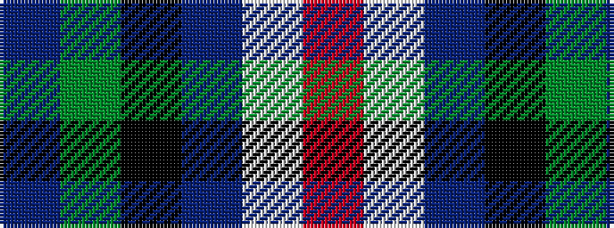

BGKBWR

It is a 6 stripe tartan.

<figure class="pat-woven">

<figcaption>idealised sample</figcaption>
</figure>

## Colour Sequence



## Tartans with this colour sequence

| Tartans |
|---------------|
| [Marion (Personal)](/setts/s6/p5g8k5db32w2r2~x2/)|
||
