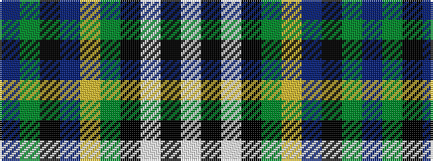

BGKBYGKWKW

It is a 10 stripe tartan.

<figure class="pat-woven">

<figcaption>idealised sample</figcaption>
</figure>

## Colour Sequence



## Tartans with this colour sequence

| Tartans |
|---------------|
| [Wellecomme, Bernard (Personal)](/variants/s10/db4dg8k8db4ly3dg21k3lb4k3lb4~x2/)|
||
