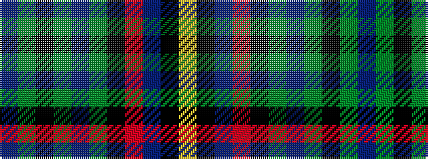

BGKGBGKRBKY

It is a 11 stripe tartan.

<figure class="pat-woven">

<figcaption>idealised sample</figcaption>
</figure>

## Colour Sequence



## Tartans with this colour sequence

| Tartans |
|---------------|
| [Moffat (1994)](/variants/s11/dp4g3k1g3dp2g20k10r20dp2k2lo4~x2/)|
||
