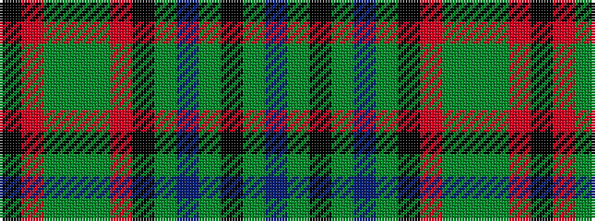

BGKGBGKRGGGRK

It is a 13 stripe tartan.

<figure class="pat-woven">

<figcaption>idealised sample</figcaption>
</figure>

## Colour Sequence



## Tartans with this colour sequence

| Tartans |
|---------------|
| [Gayre, hunting](/variants/s13/db16g4k4y22db5y22k3r5g4y4g4r4k4~x2/)|
||
