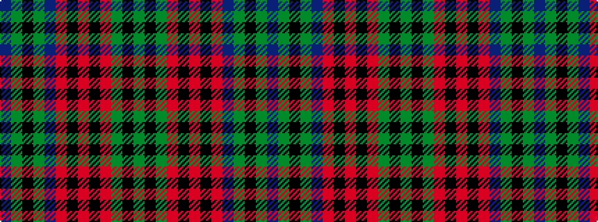

BGKGBRKRKRGKG

It is a 13 stripe tartan.

<figure class="pat-woven">

<figcaption>idealised sample</figcaption>
</figure>

## Colour Sequence



## Tartans with this colour sequence

| Tartans |
|---------------|
| [Stewart of Achnacone Clan Tartan](/variants/s13/db8g2k2g2db7r2k6r1k6r2g8k6g7~x2/)|
||
