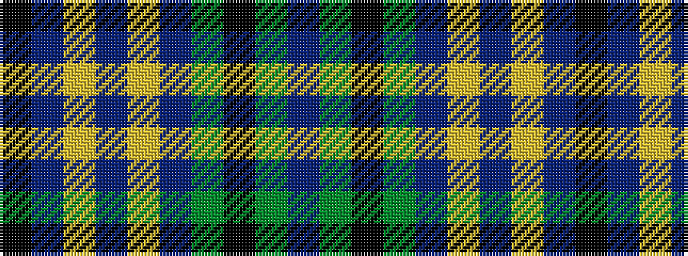

BGKGBYBYBK

It is a 10 stripe tartan.

<figure class="pat-woven">

<figcaption>idealised sample</figcaption>
</figure>

## Colour Sequence



## Tartans with this colour sequence

| Tartans |
|---------------|
| [St Andrews, University of](/variants/s10/k3db2ly2db2ly3dbi16g4k3g3db3~x2/)|
||
