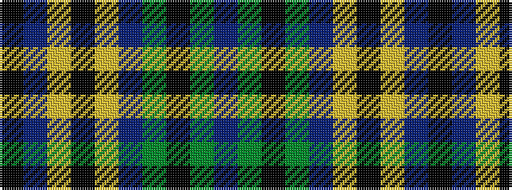

BGKGBYKYBK

It is a 10 stripe tartan.

<figure class="pat-woven">

<figcaption>idealised sample</figcaption>
</figure>

## Colour Sequence



## Tartans with this colour sequence

| Tartans |
|---------------|
| [St Andrews University Corporate Tartan](/variants/s10/k3db2ly3k2ly5db18g3k3g2db3~x2/)|
||
