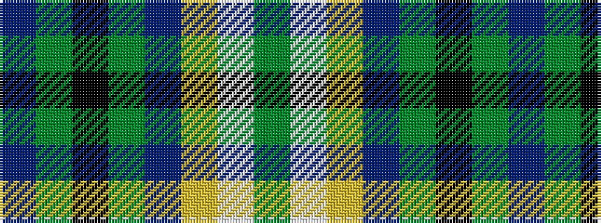

BGKGBYWG

It is a 8 stripe tartan.

<figure class="pat-woven">

<figcaption>idealised sample</figcaption>
</figure>

## Colour Sequence



## Tartans with this colour sequence

| Tartans |
|---------------|
| [Unidentified Lady's kilt](/setts/s8/db39dyi3k14dyi3t14ly4w2dy2~x2/)|
||
