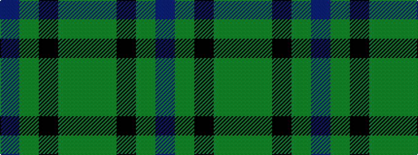

BGKGG

It is a [5 stripe pattern](/stripes/stripes5/) — every 5-stripe pattern is gathered there.

<figure class="pat-woven">

<figcaption>idealised sample</figcaption>
</figure>

## Colour Sequence



## Tartans with this colour sequence

This pattern is a design lineage: every tartan below shares one colour order, whatever its owner —
near-identical designs are grouped, the largest lineage first (#112: the pattern is a tartan's
second parent, beside its family or clan).

<table class="sett-table">
<tbody>
<tr><td><a href="/tartans/d/da/daks-house/">DAKS House</a></td></tr>
<tr><td class="sett-swatch"></td></tr>
<tr><td><a href="/tartans/d/da/daks-13/">Daks</a> <small class="dt">ΔTartan 0.08</small></td></tr>
<tr><td class="sett-swatch"></td></tr>
<tr class="cluster-sep"><td></td></tr>
<tr><td><a href="/tartans/l/la/landels/">Landels</a> <small class="dt">ΔTartan 8.16</small></td></tr>
<tr><td class="sett-swatch"></td></tr>
</tbody>
</table>

