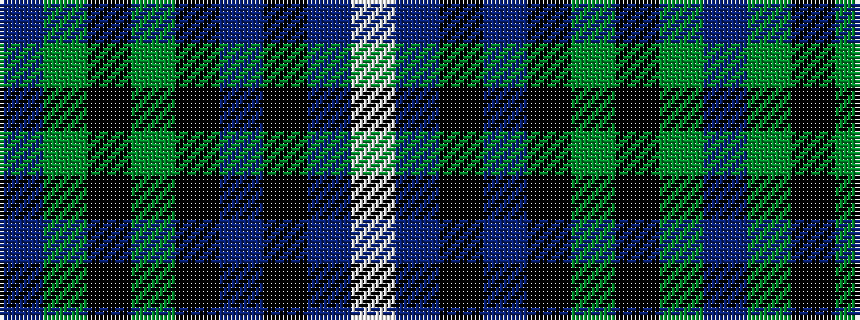

BGKGKBKBW

It is a 9 stripe tartan.

<figure class="pat-woven">

<figcaption>idealised sample</figcaption>
</figure>

## Colour Sequence



## Tartans with this colour sequence

| Tartans |
|---------------|
| [Derick Wardrope (Portobello) (Personal)](/setts/s9/dr3dg32k4dg4k11db3k7dr4w3/)|
||
