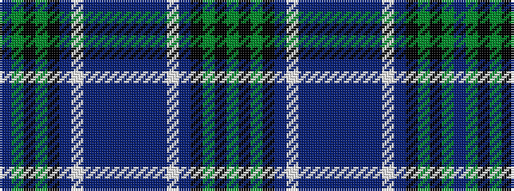

BGKGKBWBBBBBBBWBKGKG

It is a 20 stripe tartan.

<figure class="pat-woven">

<figcaption>idealised sample</figcaption>
</figure>

## Colour Sequence



## Tartans with this colour sequence

| Tartans |
|---------------|
| [Smithers](/setts/s20/g5k1g5k6b4lb1b3n1b6dp2b6n1b3lb1b4k6g5k1g5dp2~x4/)|
||
