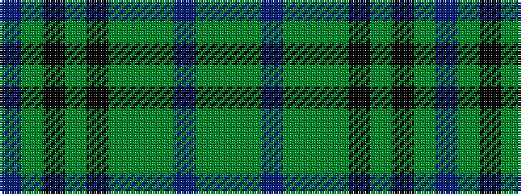

BGKGKGGGBGG

It is a 11 stripe tartan.

<figure class="pat-woven">

<figcaption>idealised sample</figcaption>
</figure>

## Colour Sequence



## Tartans with this colour sequence

| Tartans |
|---------------|
| [Mack of Stoneywood Hunting (Pers.)](/setts/s11/dg18dgi4t1dgi5dg6dgi3k1dy6k1dgi25t1~x2/)|
||
| [Mack of Stoneywood Hunting (Personal)](/setts/s11/dg18dgi4b1dgi5dg6dgi3k1dy6k1dgi25b1~x2/)|
||
