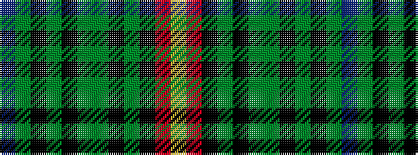

BGKGKGGKGKRY

It is a 12 stripe tartan.

<figure class="pat-woven">

<figcaption>idealised sample</figcaption>
</figure>

## Colour Sequence



## Tartans with this colour sequence

| Tartans |
|---------------|
| [Bro-Vigouden (Corporate)](/setts/s12/db29y3k3y3k3y3dg28k3y2k3r3lo3~x2/)|
||
