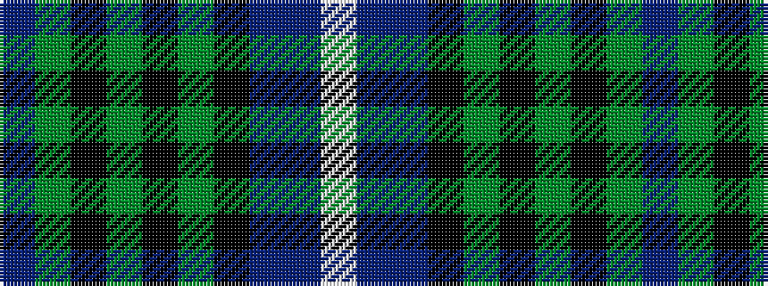

BGKGKGKBBW

It is a 10 stripe tartan.

<figure class="pat-woven">

<figcaption>idealised sample</figcaption>
</figure>

## Colour Sequence



## Tartans with this colour sequence

| Tartans |
|---------------|
| [Stewart of Bute Hunting](/setts/s10/dr22g11k2g4k2g6k16dr40dr2lb6~x2/)|
||
