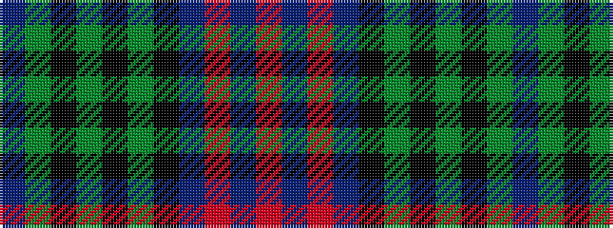

BGKGKGKBRBR

It is a 11 stripe tartan.

<figure class="pat-woven">

<figcaption>idealised sample</figcaption>
</figure>

## Colour Sequence



## Tartans with this colour sequence

| Tartans |
|---------------|
| [Clerke of Ulva](/setts/s11/t3g3k4g14k4g3k14db18r1db4r2~x2/)|
||
| [Clerke of Ulva Family Tartan Tartan Number: 168. Earliest known date: Unknown Said to have been copied from an old kilt. See products available Copyright © Blair Urquhart, Comrie, 2015](/setts/s11/t3g3k4g14k4g3k14db18m1db4m2~x2/)|
||
