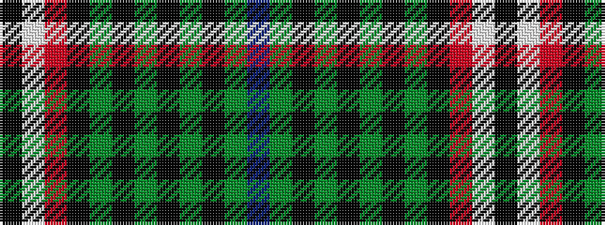

BGKGKGKGKRWK

It is a 12 stripe tartan.

<figure class="pat-woven">

<figcaption>idealised sample</figcaption>
</figure>

## Colour Sequence



## Tartans with this colour sequence

| Tartans |
|---------------|
| [Alamudi (Corporate)](/variants/s12/k13w3r3k34dg21k13dg8k5dg3k2dg1db1~x2/)|
||
