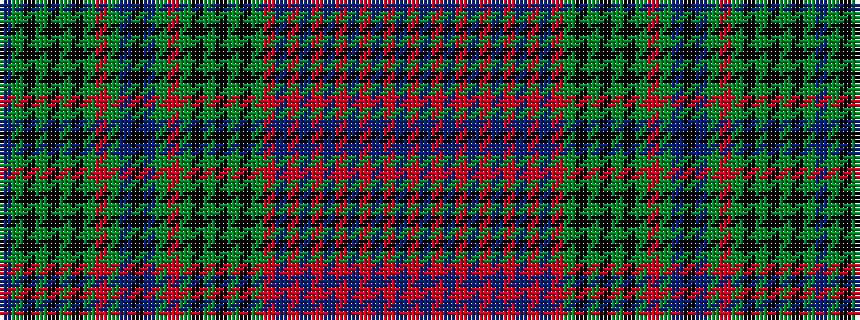

BGKGKGKGRGBKBGRGKGKGKGRBRBRBRBRBRBR

It is a 35 stripe tartan.

<figure class="pat-woven">

<figcaption>idealised sample</figcaption>
</figure>

## Colour Sequence



## Tartans with this colour sequence

| Tartans |
|---------------|
| [Unidentified "Old tartan"](/variants/s35/db6g6k3g3k3g3k3g15r9g6db3k9db3g6r9g15k3g3k3g3k3g6o9db3o3db3o3db3o6db10o3db3o3db3o3~x2/)|
||
