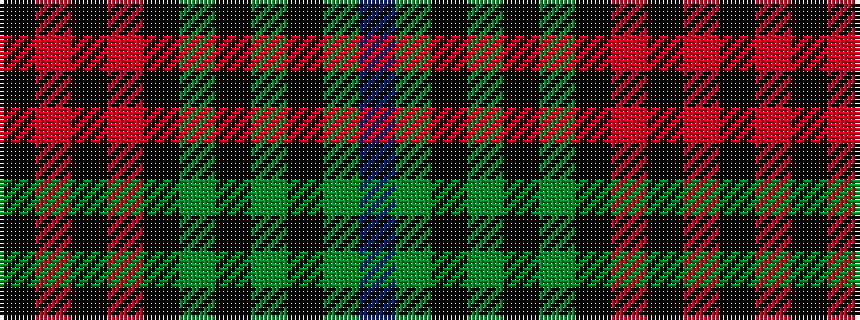

BGKGKGKRKRK

It is a 11 stripe tartan.

<figure class="pat-woven">

<figcaption>idealised sample</figcaption>
</figure>

## Colour Sequence



## Tartans with this colour sequence

| Tartans |
|---------------|
| [Father’s Pride, The](/setts/s11/do90y8k10y3k4dg4k3ri16k14r6k28/)|
||
