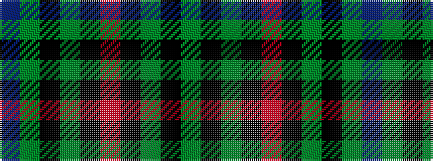

BGKGKRKGKG

It is a 10 stripe tartan.

<figure class="pat-woven">

<figcaption>idealised sample</figcaption>
</figure>

## Colour Sequence



## Tartans with this colour sequence

| Tartans |
|---------------|
| [Holman](/setts/s10/dg18k10dg13k9r3k9dg25k16dg9db3~x2/)|
||
| [Holman (Personal)](/setts/s10/g7k12g12k9r3k9g20k16g7b3~x2/)|
||
