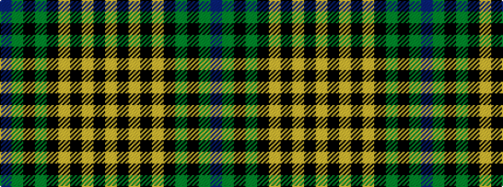

BGKGKYKYKY

It is a 10 stripe tartan.

<figure class="pat-woven">

<figcaption>idealised sample</figcaption>
</figure>

## Colour Sequence



## Tartans with this colour sequence

| Tartans |
|---------------|
| [Hickory](/variants/s10/db4dy30k2dy2k14ly2k2ly1k6ly3~x2/)|
||
