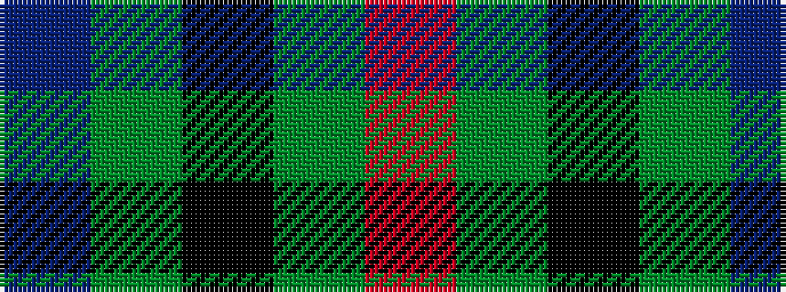

BGKGR

It is a 5 stripe tartan.

<figure class="pat-woven">

<figcaption>idealised sample</figcaption>
</figure>

## Colour Sequence



## Tartans with this colour sequence

| Tartans |
|---------------|
| [Espy (Fashion?)](/variants/s5/r10g3k1g3b1~x16/)|
||
| [Waugh](/variants/s5/db100y10k5y10r8/)|
||
