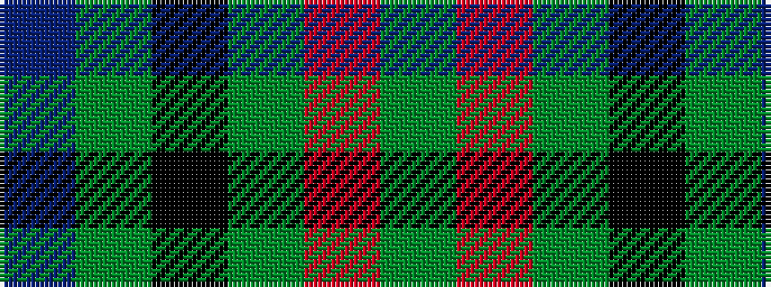

BGKGRG

It is a 6 stripe tartan.

<figure class="pat-woven">

<figcaption>idealised sample</figcaption>
</figure>

## Colour Sequence



## Tartans with this colour sequence

| Tartans |
|---------------|
| [Milton](/setts/s6/g8r3g4k6g9dp2~x2/)|
||
| [Milton (Name?)](/setts/s6/g8r3g4k6g9dp2~x4/)|
||
