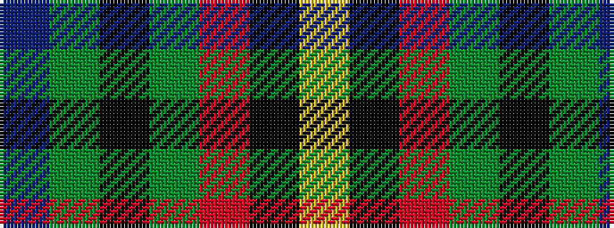

BGKGRKY

It is a 7 stripe tartan.

<figure class="pat-woven">

<figcaption>idealised sample</figcaption>
</figure>

## Colour Sequence



## Tartans with this colour sequence

| Tartans |
|---------------|
| [Scottish Parliament](/variants/s7/db8g11k3g11m12ki10ly2~x2/)|
||
| [Scottish Parliament (unofficial)](/variants/s7/db14g18k3g18r20k14lo3~x2/)|
||
