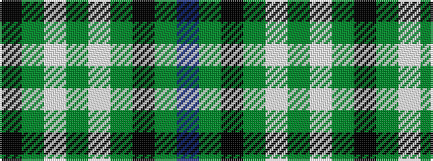

BGKGWGWGK

It is a 9 stripe tartan.

<figure class="pat-woven">

<figcaption>idealised sample</figcaption>
</figure>

## Colour Sequence



## Tartans with this colour sequence

| Tartans |
|---------------|
| [Graden (Personal)](/variants/s9/db22g4k4g14lb3g4lb3g4k3~x2/)|
||
| [Tweedside Hunting](/variants/s9/db18g2k2g5w2g2w2g2k2~x4/)|
||
| [Tweedside, hunting](/variants/s9/db21g5k5g15w3g5w3g5k3~x2/)|
||
