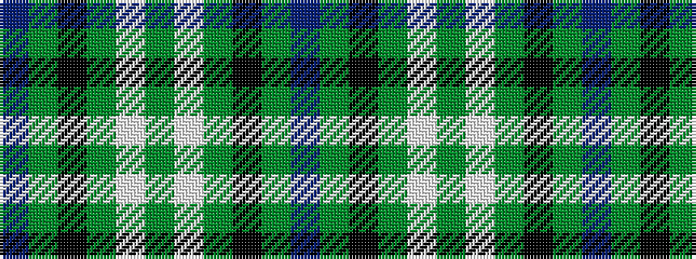

BGKGWGWGKGB

It is a 11 stripe tartan.

<figure class="pat-woven">

<figcaption>idealised sample</figcaption>
</figure>

## Colour Sequence



## Tartans with this colour sequence

| Tartans |
|---------------|
| [Hibernian F.C.](/setts/s11/p3dg6k9g11w1g11w1g11k9dg6p3~x4/)|
||
