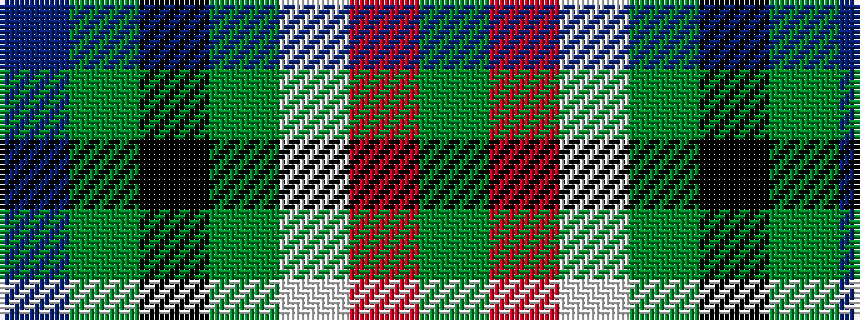

BGKGWRG

It is a 7 stripe tartan.

<figure class="pat-woven">

<figcaption>idealised sample</figcaption>
</figure>

## Colour Sequence



## Tartans with this colour sequence

| Tartans |
|---------------|
| [Java Saint Andrew Society Hunting](/setts/s7/dt50g26k9g4lb2r2g10~x2/)|
||
| [Java St Andrew Society hunting](/setts/s7/db50dg26k9dg4w2r2dg10~x2/)|
||
