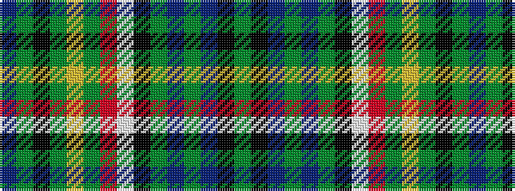

BGKGYGRWKGBGBKG

It is a 15 stripe tartan.

<figure class="pat-woven">

<figcaption>idealised sample</figcaption>
</figure>

## Colour Sequence



## Tartans with this colour sequence

| Tartans |
|---------------|
| [Euler Hermes](/setts/s15/t86gi6k24dy6lo6g6r6lb6k4gi22t6gi8t8k3gi8/)|
||
