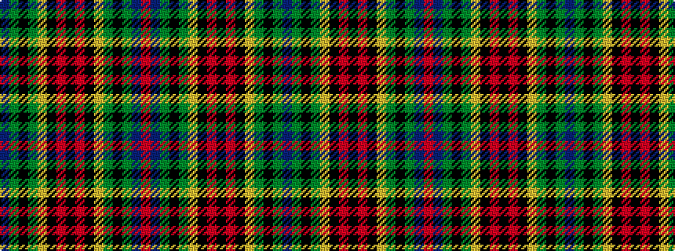

BGKGYKRKRKYGKGBR

It is a 16 stripe tartan.

<figure class="pat-woven">

<figcaption>idealised sample</figcaption>
</figure>

## Colour Sequence



## Tartans with this colour sequence

| Tartans |
|---------------|
| [Shanahan](/variants/s16/b17g16k2g24lo3k4r2k2r2k4lo3g24k2g16b17r2~x2/)|
||
