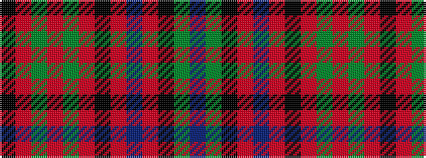

BGKRBRKRGRGRK

It is a 13 stripe tartan.

<figure class="pat-woven">

<figcaption>idealised sample</figcaption>
</figure>

## Colour Sequence



## Tartans with this colour sequence

| Tartans |
|---------------|
| [Gayre Hunting](/variants/s13/db20g4k4o20db4o20k3r6g4o4g4r4k4~x2/)|
||
| [Gayre Hunting Clan Tartan](/variants/s13/db16g4k4o22db5o22k3r5g4o4g4r4k4~x2/)|
||
