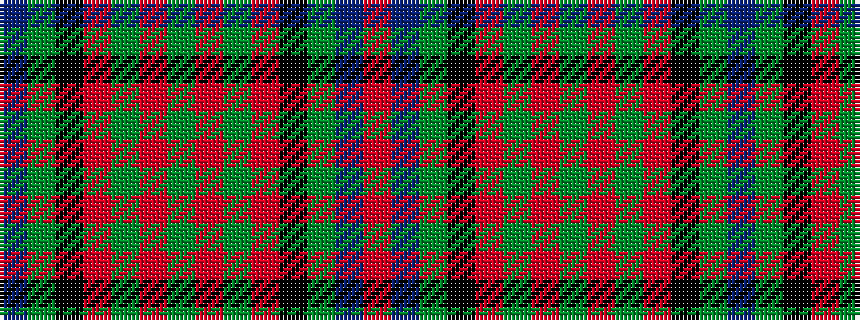

BGKRGRGRGRKGBR

It is a 14 stripe tartan.

<figure class="pat-woven">

<figcaption>idealised sample</figcaption>
</figure>

## Colour Sequence



## Tartans with this colour sequence

| Tartans |
|---------------|
| [Sheffield, City of](/setts/s14/t5g5k4o31gi3o3gi62o3gi3o31k4g5t5r3~x2/)|
||
