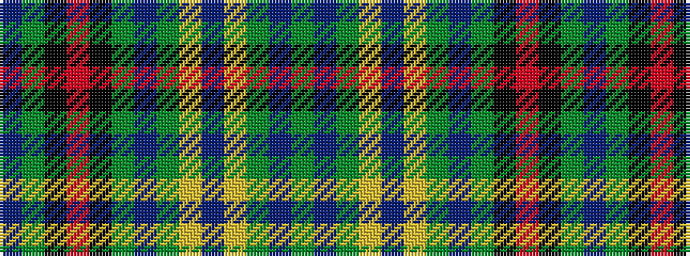

BGKRKGBGYBYGBG

It is a 14 stripe tartan.

<figure class="pat-woven">

<figcaption>idealised sample</figcaption>
</figure>

## Colour Sequence



## Tartans with this colour sequence

| Tartans |
|---------------|
| [Penman](/variants/s14/y11db6g6ly1db2ly1g6db6y36k1r3k1g5db5~x2/)|
||
| [Penman](/variants/s14/y11db6g6ly1db2ly1g6db6y11k1r3k1g5db5~x2/)|
||
