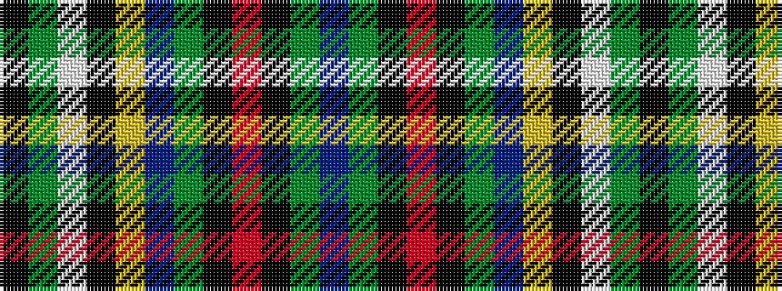

BGKRKGBYKWGK

It is a 12 stripe tartan.

<figure class="pat-woven">

<figcaption>idealised sample</figcaption>
</figure>

## Colour Sequence



## Tartans with this colour sequence

| Tartans |
|---------------|
| [Moskova](/variants/s12/k2g5w1k4ly1db4g4k1r6k1g9db2~x4/)|
||
