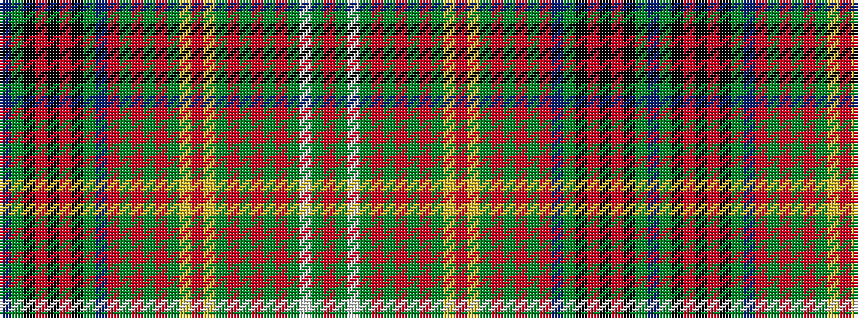

BGKRKRKGBRGRGRGYRYGRGRGRGWGR

It is a 28 stripe tartan.

<figure class="pat-woven">

<figcaption>idealised sample</figcaption>
</figure>

## Colour Sequence



## Tartans with this colour sequence

| Tartans |
|---------------|
| [MacMaster (Name 2001)](/variants/s28/r12dg12lb2dg12r12dg2r2dg2r2dg6lo2r1lo2dg6r2dg2r2dg2r12db8dg8k2r4k2r4k2dg8db8~x2/)|
||
