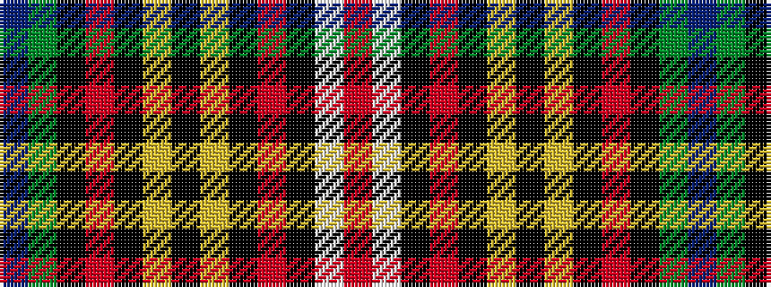

BGKRKYKYKRKWR

It is a 13 stripe tartan.

<figure class="pat-woven">

<figcaption>idealised sample</figcaption>
</figure>

## Colour Sequence



## Tartans with this colour sequence

| Tartans |
|---------------|
| [Buchanan Dress Clan Tartan Tartan Number: 608. Earliest known date: 1977 Nothing See products available Copyright © Blair Urquhart, Comrie, 2015](/setts/s13/r3w34k2o4k2ly7k2ly7k2o4k2dy34t3~x2/)|
||
