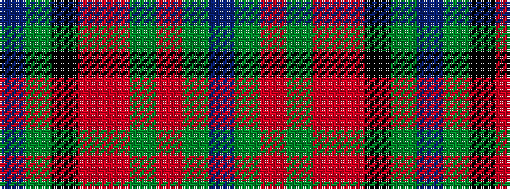

BGKRRGRGB

It is a 9 stripe tartan.

<figure class="pat-woven">

<figcaption>idealised sample</figcaption>
</figure>

## Colour Sequence



## Tartans with this colour sequence

| Tartans |
|---------------|
| [Murray of Abercairney](/variants/s9/t3y1k1ri12r1g9r1y1t3~x2/)|
||
| [Murray of Abercairney (Personal)](/variants/s9/t3y1k1r12ri1dg9ri1y1t3~x2/)|
||
