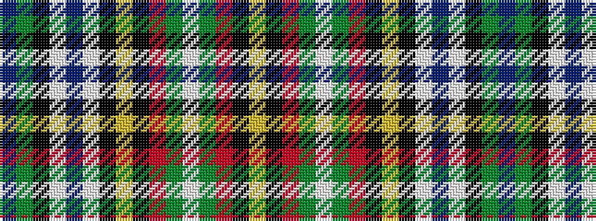

BGKWBWKYKRGWGRKY

It is a 16 stripe tartan.

<figure class="pat-woven">

<figcaption>idealised sample</figcaption>
</figure>

## Colour Sequence



## Tartans with this colour sequence

| Tartans |
|---------------|
| [Gayre Arisaidh](/variants/s16/db20dg5k5w22db5w22k2ly2k2r6dg4w4dg3r4k2ly2~x2/)|
||
| [Gayre, Arisaidh](/variants/s16/db20g5k5w22db5w22k2ly2k2r6g4w4g3r4k2ly2~x2/)|
||
