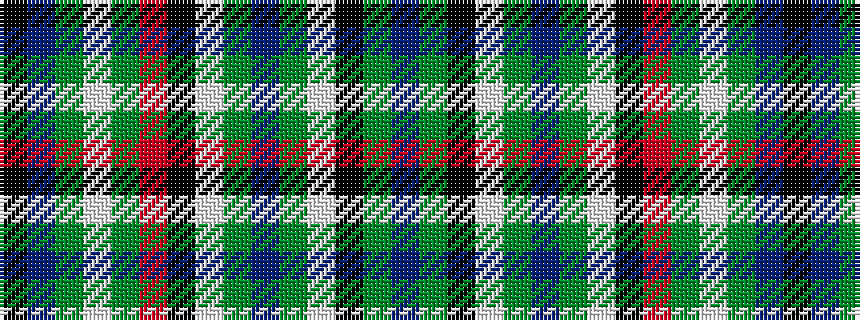

BGKWGBGWKRGWGBK

It is a 15 stripe tartan.

<figure class="pat-woven">

<figcaption>idealised sample</figcaption>
</figure>

## Colour Sequence



## Tartans with this colour sequence

| Tartans |
|---------------|
| [Gayre, dress](/variants/s15/t14g4k4w4g12t4g12w4k4r6g4w4g3t4k4~x2/)|
||
